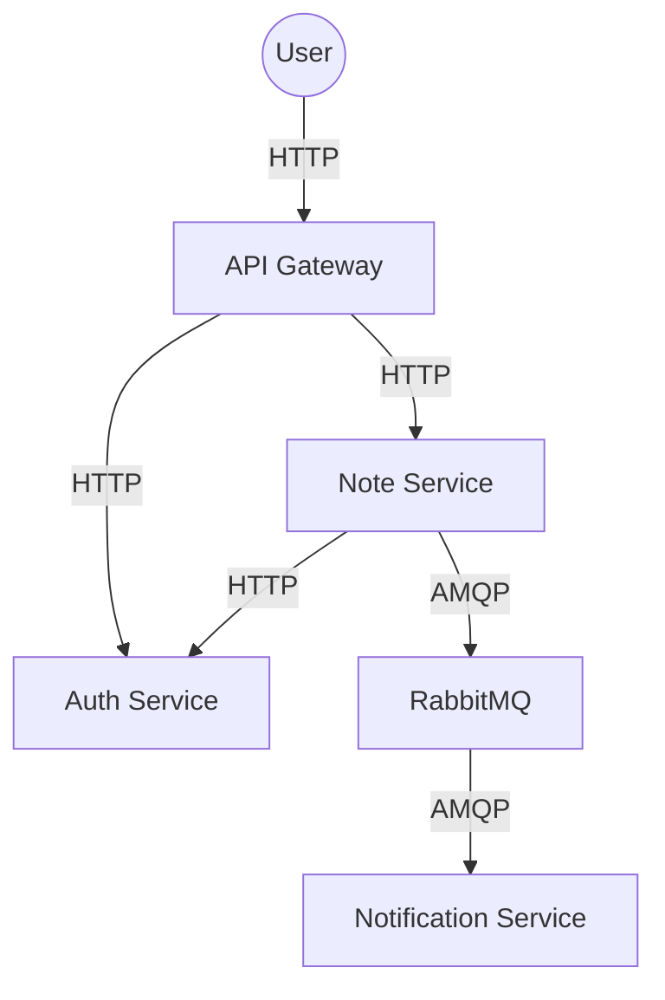

# Distributed Microservices Homework

This project implements a distributed system using FastAPI, RabbitMQ, and Docker.

## Architecture

The system consists of four main components:

1.  **API Gateway**: The entry point for all requests. It routes traffic to the Auth and Note services.
2.  **Auth Service**: Handles user registration, login, and JWT token verification.
3.  **Note Service**: Allows authenticated users to create notes. It uses REST for synchronous auth verification and RabbitMQ for asynchronous notifications.
4.  **Notification Service**: A background worker that consumes messages from RabbitMQ and "notifies" (logs) specific actions.

### Diagram



## How to Run

### Prerequisites
- Docker & Docker Compose installed.

### Steps
1. Navigate to the project directory: `c:\Users\batuh\Desktop\PAF\hmwrk\Special topic`
2. Run the services:
   ```bash
   docker-compose up --build
   ```

## API Usage Flow

1.  **Register**: `POST /auth/register` with `{"username": "test", "password": "password"}`
2.  **Login**: `POST /auth/login` (Form-data) to get a JWT `access_token`.
3.  **Create Note**: `POST /notes/notes` with Header `Authorization: Bearer <TOKEN>` and body `{"title": "My Note", "content": "Hello World"}`.

Check the logs of `notification-service` to see the asynchronous message processing.
